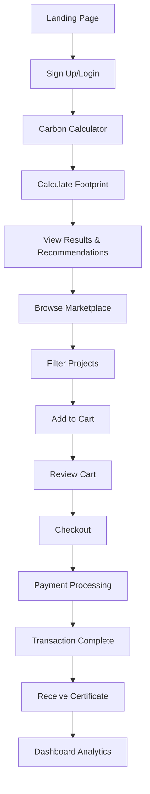
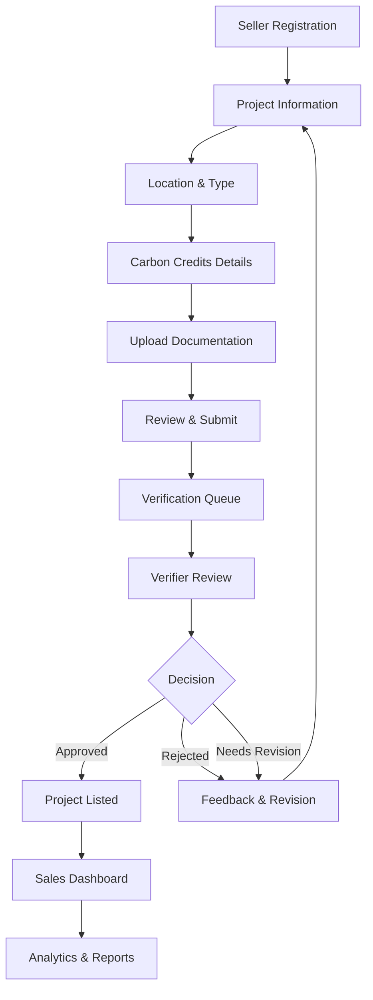
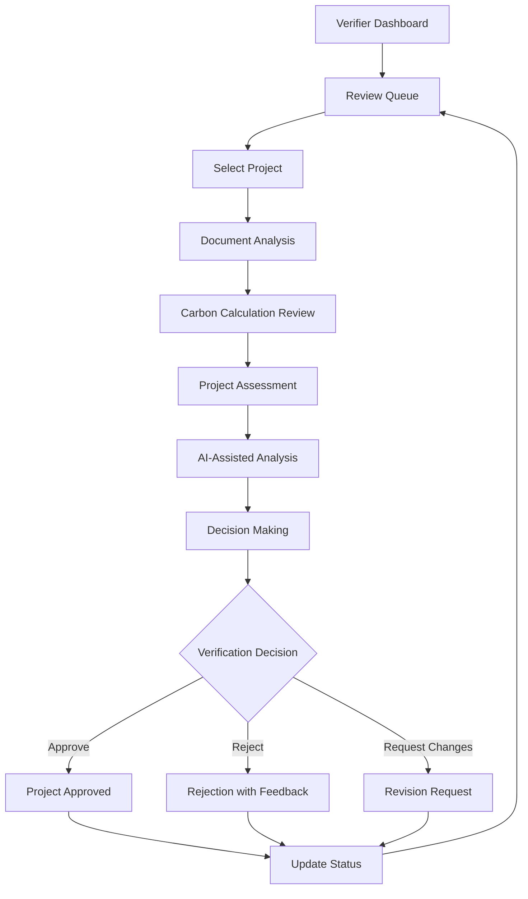

# RSustain Carbon Exchange - Project Architecture

## Table of Contents

1. [System Overview](#system-overview)
2. [High-Level Architecture](#high-level-architecture)
3. [Frontend Architecture](#frontend-architecture)
4. [Backend Architecture](#backend-architecture)
5. [Database Architecture](#database-architecture)
6. [API Design](#api-design)
7. [User Role Workflows](#user-role-workflows)
8. [Real-time Systems](#real-time-systems)
9. [Testing Architecture](#testing-architecture)
10. [Security Architecture](#security-architecture)
11. [Performance Architecture](#performance-architecture)
12. [Deployment Architecture](#deployment-architecture)

## System Overview

The RSustain Carbon Exchange is a comprehensive Next.js-based platform that provides complete carbon footprint calculation, marketplace functionality, and multi-role workflows for buyers, sellers, and verifiers in the carbon credit ecosystem. The platform features real-time database interactions, comprehensive testing infrastructure, and production-ready scalability.

### Core Capabilities

- **Complete Carbon Calculator**: EPA/DEFRA/IPCC compliant emissions assessment
- **Carbon Credit Marketplace**: Full buy/sell workflow with cart and checkout
- **Multi-Role Support**: Distinct buyer, seller, and verifier experiences
- **Real-time Operations**: Live database interactions and instant calculations
- **Comprehensive Testing**: Built-in validation and monitoring systems
- **Production-Ready**: Scalable architecture with performance optimization

## High-Level Architecture

```
┌─────────────────────────────────────────────────────────────────────────────────┐
│                            PRESENTATION LAYER                                   │
├─────────────────────────────────────────────────────────────────────────────────┤
│  Next.js Frontend (React 18 + TypeScript + Tailwind CSS)                      │
│                                                                                 │
│  ┌─────────────┐  ┌─────────────┐  ┌─────────────┐  ┌─────────────┐          │
│  │   Buyer     │  │   Seller    │  │  Verifier   │  │   Testing   │          │
│  │  Interface  │  │  Interface  │  │  Interface  │  │  Dashboard  │          │
│  └─────────────┘  └─────────────┘  └─────────────┘  └─────────────┘          │
└─────────────────────────────────────────────────────────────────────────────────┘
                                       │
                                       ▼
┌─────────────────────────────────────────────────────────────────────────────────┐
│                            APPLICATION LAYER                                    │
├─────────────────────────────────────────────────────────────────────────────────┤
│  Next.js API Routes (Server-side Business Logic)                               │
│                                                                                 │
│  ┌─────────────┐  ┌─────────────┐  ┌─────────────┐  ┌─────────────┐          │
│  │  Calculator │  │ Marketplace │  │  Seller     │  │  Verifier   │          │
│  │    API      │  │     API     │  │    API      │  │     API     │          │
│  └─────────────┘  └─────────────┘  └─────────────┘  └─────────────┘          │
│                                                                                 │
│  ┌─────────────┐  ┌─────────────┐  ┌─────────────┐  ┌─────────────┐          │
│  │    Cart     │  │  Checkout   │  │   Testing   │  │    Auth     │          │
│  │    API      │  │     API     │  │     API     │  │     API     │          │
│  └─────────────┘  └─────────────┘  └─────────────┘  └─────────────┘          │
└─────────────────────────────────────────────────────────────────────────────────┘
                                       │
                                       ▼
┌─────────────────────────────────────────────────────────────────────────────────┐
│                            BUSINESS LOGIC LAYER                                 │
├─────────────────────────────────────────────────────────────────────────────────┤
│  Core Services (TypeScript)                                                    │
│                                                                                 │
│  ┌─────────────┐  ┌─────────────┐  ┌─────────────┐  ┌─────────────┐          │
│  │   Carbon    │  │ Marketplace │  │ Verification│  │   Testing   │          │
│  │ Calculator  │  │   Service   │  │   Service   │  │   Service   │          │
│  └─────────────┘  └─────────────┘  └─────────────┘  └─────────────┘          │
│                                                                                 │
│  ┌─────────────┐  ┌─────────────┐  ┌─────────────┐  ┌─────────────┐          │
│  │  Analytics  │  │    Auth     │  │    Cart     │  │   Payment   │          │
│  │   Service   │  │   Service   │  │   Service   │  │   Service   │          │
│  └─────────────┘  └─────────────┘  └─────────────┘  └─────────────┘          │
└─────────────────────────────────────────────────────────────────────────────────┘
                                       │
                                       ▼
┌─────────────────────────────────────────────────────────────────────────────────┐
│                              DATA LAYER                                        │
├─────────────────────────────────────────────────────────────────────────────────┤
│  Supabase (PostgreSQL Database + Real-time + Auth)                             │
│                                                                                 │
│  ┌─────────────┐  ┌─────────────┐  ┌─────────────┐  ┌─────────────┐          │
│  │    Users    │  │  Projects   │  │Transactions │  │Verifications│          │
│  │   & Auth    │  │   & Market  │  │   & Sales   │  │  & Reviews  │          │
│  └─────────────┘  └─────────────┘  └─────────────┘  └─────────────┘          │
│                                                                                 │
│  ┌─────────────┐  ┌─────────────┐  ┌─────────────┐  ┌─────────────┐          │
│  │  Calculator │  │   Shopping  │  │ Certificates│  │ Activity    │          │
│  │    Data     │  │    Cart     │  │ & Credits   │  │    Logs     │          │
│  └─────────────┘  └─────────────┘  └─────────────┘  └─────────────┘          │
└─────────────────────────────────────────────────────────────────────────────────┘
```

## Frontend Architecture

### Multi-Role Interface Design

```
app/
├── layout.tsx                 # Root layout with auth & theme providers
├── page.tsx                   # Landing page with feature showcase
├── auth/
│   ├── signin/page.tsx       # User authentication
│   └── signup/page.tsx       # User registration
├── calculator/page.tsx        # Carbon footprint calculator
├── marketplace/page.tsx       # Carbon credit marketplace
├── dashboard/page.tsx         # User dashboard (role-based)
├── checkout/page.tsx          # Purchase completion
├── retire-credits/page.tsx    # Certificate management
├── seller/
│   ├── dashboard/page.tsx    # Seller portal
│   └── register/page.tsx     # Project registration
├── verifier/
│   ├── queue/page.tsx        # Verification queue
│   └── review/[id]/page.tsx  # Project review
└── test-dashboard/page.tsx   # Testing & validation interface
```

### Component Architecture

```
components/
├── ui/                       # Base UI components (shadcn/ui)
│   ├── button.tsx           # Reusable button component
│   ├── card.tsx             # Card layouts
│   ├── form.tsx             # Form components
│   ├── table.tsx            # Data tables
│   └── chart.tsx            # Data visualization
├── auth-provider.tsx         # Authentication context
├── theme-provider.tsx        # Dark/light theme management
├── navigation.tsx            # Main navigation with role-based menus
├── calculator/
│   └── carbon-calculator.tsx # Complete calculator interface
├── marketplace/
│   ├── marketplace-header.tsx # Marketplace controls
│   ├── marketplace-filters.tsx # Project filtering
│   ├── project-grid.tsx      # Project listings
│   └── project-map.tsx       # Geographic project map
├── buyer/
│   ├── cart.tsx             # Shopping cart interface
│   ├── checkout.tsx         # Purchase workflow
│   ├── certificates.tsx     # Certificate management
│   ├── purchase-history.tsx # Transaction history
│   └── settings.tsx         # Buyer preferences
├── dashboard/
│   ├── dashboard-header.tsx # Dashboard controls
│   ├── dashboard-stats.tsx  # Key metrics display
│   ├── portfolio-overview.tsx # Carbon credit portfolio
│   ├── recent-transactions.tsx # Transaction feed
│   └── risk-assessment.tsx  # Risk analysis
├── hero-section.tsx         # Landing page hero
├── features-section.tsx     # Feature showcase
└── stats-section.tsx        # Platform statistics
```

### State Management Pattern

```typescript
// Authentication State
const AuthProvider = ({ children }) => {
  const [user, setUser] = useState(null)
  const [loading, setLoading] = useState(true)
  
  // Supabase auth integration
  useEffect(() => {
    const { data: { subscription } } = supabase.auth.onAuthStateChange(
      (event, session) => {
        setUser(session?.user ?? null)
        setLoading(false)
      }
    )
    return () => subscription.unsubscribe()
  }, [])
  
  return (
    <AuthContext.Provider value={{ user, loading }}>
      {children}
    </AuthContext.Provider>
  )
}

// Cart State Management
const useCart = () => {
  const [items, setItems] = useState([])
  const [loading, setLoading] = useState(false)
  
  const addItem = async (projectId, quantity) => {
    setLoading(true)
    try {
      const response = await fetch('/api/cart', {
        method: 'POST',
        body: JSON.stringify({ projectId, quantity })
      })
      const result = await response.json()
      setItems(result.items)
    } catch (error) {
      console.error('Failed to add item:', error)
    }
    setLoading(false)
  }
  
  return { items, addItem, loading }
}
```

## Backend Architecture

### API Route Structure

```
app/api/
├── auth/
│   └── callback/route.ts     # Supabase auth callback
├── carbon-calculator/
│   ├── calculate/route.ts    # POST - Calculate emissions
│   ├── emission-factors/route.ts # GET - Emission factors
│   └── assessments/route.ts  # GET/PATCH/DELETE - Assessment CRUD
├── projects/route.ts         # GET - Project listings
├── cart/route.ts            # GET/POST/DELETE - Cart management
├── checkout/route.ts        # POST - Purchase processing
├── seller/route.ts          # GET/POST - Seller operations
├── verifier/route.ts        # GET/POST - Verifier operations
├── test-db/route.ts         # GET - Database testing
├── test-db-detailed/route.ts # GET - Detailed DB validation
├── test-env/route.ts        # GET - Environment testing
└── setup-tables/route.ts    # POST - Database table setup
```

### Service Layer Architecture

```typescript
// Carbon Calculator Service
class CarbonCalculatorService {
  async calculateEmissions(data: CalculationRequest) {
    const scope1 = await this.calculateScope1(data.scope1Data)
    const scope2 = await this.calculateScope2(data.scope2Data)
    const scope3 = await this.calculateScope3(data.scope3Data)
    
    return {
      summary: {
        scope1Total: scope1.total,
        scope2Total: scope2.total,
        scope3Total: scope3.total,
        totalEmissions: scope1.total + scope2.total + scope3.total
      },
      detailed: { scope1, scope2, scope3 },
      confidence: this.calculateConfidence([scope1, scope2, scope3])
    }
  }
  
  private async calculateScope1(data: Scope1Data[]) {
    // Implementation using EPA/DEFRA factors
  }
}

// Marketplace Service
class MarketplaceService {
  async getProjects(filters: ProjectFilters) {
    return await supabase
      .from('projects')
      .select('*')
      .eq('verification_status', 'verified')
      .gt('credits_available', 0)
      .order('created_at', { ascending: false })
  }
  
  async purchaseCredits(userId: string, items: CartItem[]) {
    const transaction = await supabase.rpc('process_purchase', {
      user_id: userId,
      cart_items: items
    })
    return transaction
  }
}

// Verifier Service
class VerifierService {
  async getVerificationQueue() {
    return await supabase
      .from('verifications')
      .select(`
        *,
        projects (
          name,
          type,
          location,
          description
        )
      `)
      .eq('status', 'pending')
      .order('priority', { ascending: false })
  }
  
  async reviewProject(verificationId: string, decision: VerificationDecision) {
    // Update verification status and send notifications
  }
}
```

## Database Architecture

### Complete Schema Overview

```sql
-- Core User Management
CREATE TABLE users (
  id UUID PRIMARY KEY DEFAULT gen_random_uuid(),
  email TEXT UNIQUE NOT NULL,
  role TEXT DEFAULT 'buyer' CHECK (role IN ('buyer', 'seller', 'verifier')),
  created_at TIMESTAMP DEFAULT NOW(),
  updated_at TIMESTAMP DEFAULT NOW()
);

-- Carbon Projects (Marketplace)
CREATE TABLE projects (
  id UUID PRIMARY KEY DEFAULT gen_random_uuid(),
  seller_id UUID REFERENCES users(id),
  name TEXT NOT NULL,
  type TEXT NOT NULL,
  location TEXT,
  description TEXT,
  verification_status TEXT DEFAULT 'pending',
  credits_total INTEGER NOT NULL,
  credits_available INTEGER NOT NULL,
  price_per_credit DECIMAL(10,2) NOT NULL,
  created_at TIMESTAMP DEFAULT NOW()
);

-- Verification System
CREATE TABLE verifications (
  id UUID PRIMARY KEY DEFAULT gen_random_uuid(),
  project_id UUID REFERENCES projects(id),
  verifier_id UUID REFERENCES users(id),
  status TEXT DEFAULT 'pending',
  priority INTEGER DEFAULT 1,
  decision TEXT,
  feedback TEXT,
  created_at TIMESTAMP DEFAULT NOW()
);

-- Transaction System
CREATE TABLE transactions (
  id UUID PRIMARY KEY DEFAULT gen_random_uuid(),
  buyer_id UUID REFERENCES users(id),
  project_id UUID REFERENCES projects(id),
  quantity INTEGER NOT NULL,
  unit_price DECIMAL(10,2) NOT NULL,
  total_amount DECIMAL(10,2) NOT NULL,
  status TEXT DEFAULT 'pending',
  created_at TIMESTAMP DEFAULT NOW()
);

-- Shopping Cart
CREATE TABLE cart_items (
  id UUID PRIMARY KEY DEFAULT gen_random_uuid(),
  user_id UUID REFERENCES users(id),
  project_id UUID REFERENCES projects(id),
  quantity INTEGER NOT NULL,
  created_at TIMESTAMP DEFAULT NOW()
);

-- Carbon Credits & Certificates
CREATE TABLE certificates (
  id UUID PRIMARY KEY DEFAULT gen_random_uuid(),
  transaction_id UUID REFERENCES transactions(id),
  certificate_number TEXT UNIQUE NOT NULL,
  credits_retired INTEGER,
  retirement_date TIMESTAMP,
  created_at TIMESTAMP DEFAULT NOW()
);

-- Carbon Calculator Data
CREATE TABLE carbon_assessments (
  id UUID PRIMARY KEY DEFAULT gen_random_uuid(),
  user_id UUID REFERENCES users(id),
  organization_name TEXT,
  reporting_year INTEGER,
  total_emissions DECIMAL(15,2),
  scope1_total DECIMAL(15,2),
  scope2_total DECIMAL(15,2),
  scope3_total DECIMAL(15,2),
  confidence_score DECIMAL(3,2),
  created_at TIMESTAMP DEFAULT NOW()
);

-- Scientific Emission Factors
CREATE TABLE emission_factors (
  id UUID PRIMARY KEY DEFAULT gen_random_uuid(),
  category TEXT NOT NULL,
  subcategory TEXT NOT NULL,
  scope INTEGER NOT NULL,
  emission_factor DECIMAL(10,6) NOT NULL,
  unit TEXT NOT NULL,
  source TEXT NOT NULL,
  region TEXT DEFAULT 'Global',
  year INTEGER DEFAULT 2023,
  created_at TIMESTAMP DEFAULT NOW()
);

-- Audit & Activity Logs
CREATE TABLE activity_logs (
  id UUID PRIMARY KEY DEFAULT gen_random_uuid(),
  user_id UUID REFERENCES users(id),
  action TEXT NOT NULL,
  resource_type TEXT,
  resource_id UUID,
  metadata JSONB,
  created_at TIMESTAMP DEFAULT NOW()
);

-- Project Documentation
CREATE TABLE project_documents (
  id UUID PRIMARY KEY DEFAULT gen_random_uuid(),
  project_id UUID REFERENCES projects(id),
  document_type TEXT NOT NULL,
  file_name TEXT NOT NULL,
  file_url TEXT,
  uploaded_at TIMESTAMP DEFAULT NOW()
);
```

### Database Relationships

```
Users (1:N) → Projects (Sellers)
Users (1:N) → Transactions (Buyers)
Users (1:N) → Verifications (Verifiers)
Users (1:N) → Cart Items
Users (1:N) → Carbon Assessments

Projects (1:N) → Transactions
Projects (1:1) → Verifications
Projects (1:N) → Project Documents

Transactions (1:1) → Certificates

Carbon Assessments (1:N) → Scope Emissions Data
Emission Factors → Scope Emissions Data
```

### Performance Indexing

```sql
-- Performance Indexes
CREATE INDEX idx_projects_verification_status ON projects(verification_status);
CREATE INDEX idx_projects_credits_available ON projects(credits_available);
CREATE INDEX idx_verifications_status_priority ON verifications(status, priority);
CREATE INDEX idx_transactions_buyer_id ON transactions(buyer_id);
CREATE INDEX idx_cart_items_user_id ON cart_items(user_id);
CREATE INDEX idx_emission_factors_category_scope ON emission_factors(category, scope);
CREATE INDEX idx_activity_logs_user_action ON activity_logs(user_id, action);
```

## API Design

### RESTful Endpoint Design

```typescript
// Carbon Calculator API
interface CalculatorAPI {
  // POST /api/carbon-calculator/calculate
  calculate: (data: CalculationRequest) => Promise<CalculationResult>
  
  // GET /api/carbon-calculator/emission-factors
  getEmissionFactors: (filters: EmissionFactorFilters) => Promise<EmissionFactor[]>
  
  // GET /api/carbon-calculator/assessments
  getAssessments: (userId: string) => Promise<Assessment[]>
}

// Marketplace API
interface MarketplaceAPI {
  // GET /api/projects
  getProjects: (filters: ProjectFilters) => Promise<Project[]>
  
  // GET /api/cart
  getCart: (userId: string) => Promise<CartItem[]>
  
  // POST /api/cart
  addToCart: (item: CartItem) => Promise<CartResponse>
  
  // POST /api/checkout
  processCheckout: (checkoutData: CheckoutRequest) => Promise<Transaction>
}

// Seller API
interface SellerAPI {
  // GET /api/seller
  getDashboard: (sellerId: string) => Promise<SellerDashboard>
  
  // POST /api/seller
  registerProject: (projectData: ProjectRegistration) => Promise<Project>
}

// Verifier API
interface VerifierAPI {
  // GET /api/verifier
  getQueue: () => Promise<VerificationItem[]>
  
  // POST /api/verifier
  submitReview: (review: VerificationReview) => Promise<VerificationResult>
}
```

### Request/Response Schemas

```typescript
interface CalculationRequest {
  assessment: {
  organizationName: string
    reportingYear: number
    reportingPeriodStart: string
    reportingPeriodEnd: string
  }
  scope1Data: EmissionSource[]
  scope2Data: EmissionSource[]
  scope3Data: EmissionSource[]
  region: string
}

interface CalculationResult {
  assessmentId: string
  summary: {
    totalEmissions: number
    scope1Total: number
    scope2Total: number
    scope3Total: number
    confidenceScore: number
  }
  breakdown: ScopeBreakdown[]
  insights: Insight[]
}

interface ProjectRegistration {
  name: string
  type: string
  location: string
  description: string
  creditsTotal: number
  pricePerCredit: number
  documents: ProjectDocument[]
}

interface VerificationReview {
  verificationId: string
  decision: 'approved' | 'rejected' | 'needs_revision'
  feedback: string
  reviewData: {
    documentationQuality: number
    projectViability: number
    carbonCalculations: number
    overallScore: number
  }
}
```

## User Role Workflows

### Buyer Journey



### Seller Journey



### Verifier Workflow



## Real-time Systems

### Real-time Database Integration

```typescript
// Real-time project updates
const useProjectUpdates = (projectId: string) => {
  const [project, setProject] = useState(null)
  
  useEffect(() => {
    const subscription = supabase
      .channel(`project:${projectId}`)
      .on('postgres_changes', {
        event: '*',
        schema: 'public',
        table: 'projects',
        filter: `id=eq.${projectId}`
      }, (payload) => {
        setProject(payload.new)
      })
      .subscribe()
      
    return () => subscription.unsubscribe()
  }, [projectId])
  
  return project
}

// Real-time verification queue
const useVerificationQueue = () => {
  const [queue, setQueue] = useState([])
  
  useEffect(() => {
    const subscription = supabase
      .channel('verification-queue')
      .on('postgres_changes', {
        event: '*',
        schema: 'public',
        table: 'verifications'
      }, () => {
        // Refresh queue data
        fetchVerificationQueue().then(setQueue)
      })
      .subscribe()
      
    return () => subscription.unsubscribe()
  }, [])
  
  return queue
}
```

### Live Analytics

```typescript
// Real-time dashboard metrics
const useDashboardMetrics = () => {
  const [metrics, setMetrics] = useState({
    totalProjects: 0,
    pendingVerifications: 0,
    completedTransactions: 0,
    activeUsers: 0
  })
  
  useEffect(() => {
    const updateMetrics = async () => {
      const [projects, verifications, transactions, users] = await Promise.all([
        supabase.from('projects').select('count'),
        supabase.from('verifications').select('count').eq('status', 'pending'),
        supabase.from('transactions').select('count').eq('status', 'completed'),
        supabase.from('users').select('count')
      ])
      
      setMetrics({
        totalProjects: projects.count,
        pendingVerifications: verifications.count,
        completedTransactions: transactions.count,
        activeUsers: users.count
      })
    }
    
    updateMetrics()
    const interval = setInterval(updateMetrics, 30000) // Update every 30s
    
    return () => clearInterval(interval)
  }, [])
  
  return metrics
}
```

## Testing Architecture

### Test Dashboard System

```typescript
// Test Dashboard API Integration
const TestDashboard = () => {
  const [testResults, setTestResults] = useState({
    databaseTests: [],
    apiTests: [],
    featureTests: [],
    performanceTests: []
  })
  
  const runAllTests = async () => {
    const results = await Promise.all([
      fetch('/api/test-db-detailed').then(r => r.json()),
      testAllAPIEndpoints(),
      testFeatureWorkflows(),
      testPerformanceMetrics()
    ])
    
    setTestResults({
      databaseTests: results[0],
      apiTests: results[1],
      featureTests: results[2],
      performanceTests: results[3]
    })
  }
  
  const testAllAPIEndpoints = async () => {
    const endpoints = [
      '/api/projects',
      '/api/carbon-calculator/emission-factors',
      '/api/seller',
      '/api/verifier',
      '/api/cart'
    ]
    
    return Promise.all(
      endpoints.map(async (endpoint) => {
        const start = Date.now()
        try {
          const response = await fetch(endpoint)
          const duration = Date.now() - start
          return {
            endpoint,
            status: response.status,
            duration,
            success: response.ok
          }
        } catch (error) {
          return {
            endpoint,
            status: 0,
            duration: Date.now() - start,
            success: false,
            error: error.message
          }
        }
      })
    )
  }
  
  return (
    <div className="test-dashboard">
      <TestResultsDisplay results={testResults} />
      <button onClick={runAllTests}>Run All Tests</button>
    </div>
  )
}
```

### Automated Testing Suite

```typescript
// Database Validation Tests
const validateDatabaseSchema = async () => {
  const requiredTables = [
    'users', 'projects', 'transactions', 'verifications',
    'cart_items', 'certificates', 'carbon_assessments',
    'emission_factors', 'activity_logs', 'project_documents'
  ]
  
  const results = await Promise.all(
    requiredTables.map(async (table) => {
      try {
        const { count } = await supabase
          .from(table)
          .select('*', { count: 'exact', head: true })
        
        return {
          table,
          exists: true,
          recordCount: count,
          status: 'pass'
        }
      } catch (error) {
        return {
          table,
          exists: false,
          error: error.message,
          status: 'fail'
        }
      }
    })
  )
  
  return results
}

// API Integration Tests
const testAPIIntegration = async () => {
  const tests = [
    {
      name: 'Carbon Calculator API',
      test: async () => {
        const response = await fetch('/api/carbon-calculator/emission-factors')
        return response.ok
      }
    },
    {
      name: 'Projects API',
      test: async () => {
        const response = await fetch('/api/projects')
        return response.ok
      }
    },
    {
      name: 'Seller API',
      test: async () => {
        const response = await fetch('/api/seller')
        return response.ok
      }
    }
  ]
  
  return Promise.all(
    tests.map(async ({ name, test }) => {
      try {
        const success = await test()
        return { name, success, status: success ? 'pass' : 'fail' }
      } catch (error) {
        return { name, success: false, status: 'fail', error: error.message }
      }
    })
  )
}
```

## Security Architecture

### Authentication & Authorization

```typescript
// Row-Level Security Policies
/*
-- Users can only see their own data
CREATE POLICY "Users can view own profile" ON users
  FOR SELECT USING (auth.uid() = id);

-- Sellers can manage their own projects
CREATE POLICY "Sellers manage own projects" ON projects
  FOR ALL USING (auth.uid() = seller_id);

-- Buyers can view verified projects
CREATE POLICY "Buyers view verified projects" ON projects
  FOR SELECT USING (verification_status = 'verified');

-- Verifiers can access pending verifications
CREATE POLICY "Verifiers access pending reviews" ON verifications
  FOR ALL USING (
    EXISTS (
      SELECT 1 FROM users 
      WHERE id = auth.uid() AND role = 'verifier'
    )
  );
*/

// API Route Protection
const withAuth = (handler: NextApiHandler) => {
  return async (req: NextApiRequest, res: NextApiResponse) => {
    const token = req.headers.authorization?.replace('Bearer ', '')
    
    if (!token) {
      return res.status(401).json({ error: 'Unauthorized' })
    }
    
    try {
      const { data: { user }, error } = await supabase.auth.getUser(token)
      
      if (error || !user) {
        return res.status(401).json({ error: 'Invalid token' })
      }
      
      req.user = user
      return handler(req, res)
    } catch (error) {
      return res.status(500).json({ error: 'Auth validation failed' })
    }
  }
}

// Role-based Access Control
const withRole = (roles: string[], handler: NextApiHandler) => {
  return withAuth(async (req: NextApiRequest, res: NextApiResponse) => {
    const { data: profile } = await supabase
      .from('users')
      .select('role')
      .eq('id', req.user.id)
      .single()
    
    if (!profile || !roles.includes(profile.role)) {
      return res.status(403).json({ error: 'Insufficient permissions' })
    }
    
    return handler(req, res)
  })
}
```

### Input Validation & Sanitization

```typescript
// Request Validation Schemas
const CalculationRequestSchema = z.object({
  assessment: z.object({
    organizationName: z.string().min(1).max(200),
    reportingYear: z.number().min(2000).max(2030),
    reportingPeriodStart: z.string().datetime(),
    reportingPeriodEnd: z.string().datetime()
  }),
  scope1Data: z.array(EmissionSourceSchema),
  scope2Data: z.array(EmissionSourceSchema),
  scope3Data: z.array(EmissionSourceSchema),
  region: z.enum(['US', 'UK', 'EU', 'Global'])
})

const EmissionSourceSchema = z.object({
  sourceType: z.string(),
  activityData: z.number().positive(),
  activityUnit: z.string(),
  facilityName: z.string().optional()
})

// API Validation Middleware
const validateRequest = (schema: z.ZodSchema) => {
  return (handler: NextApiHandler) => {
    return async (req: NextApiRequest, res: NextApiResponse) => {
      try {
        const validatedData = schema.parse(req.body)
        req.body = validatedData
        return handler(req, res)
      } catch (error) {
        if (error instanceof z.ZodError) {
          return res.status(400).json({
            error: 'Validation failed',
            details: error.errors
          })
        }
        return res.status(500).json({ error: 'Validation error' })
      }
    }
  }
}
```

## Performance Architecture

### Database Optimization

```sql
-- Optimized Queries with Indexes
CREATE INDEX CONCURRENTLY idx_projects_search ON projects 
USING GIN (to_tsvector('english', name || ' ' || description));

CREATE INDEX CONCURRENTLY idx_emission_factors_lookup ON emission_factors
(category, subcategory, scope, region);

CREATE INDEX CONCURRENTLY idx_transactions_user_date ON transactions
(buyer_id, created_at DESC);

-- Query Optimization Examples
-- Fast project search with filters
SELECT p.*, v.status as verification_status
FROM projects p
LEFT JOIN verifications v ON p.id = v.project_id
WHERE p.verification_status = 'verified'
  AND p.credits_available > 0
  AND ($1::text IS NULL OR p.type = $1)
  AND ($2::text IS NULL OR p.location ILIKE $2)
ORDER BY p.created_at DESC
LIMIT 20 OFFSET $3;

-- Efficient emission factor lookup
SELECT emission_factor, unit, source
FROM emission_factors
WHERE category = $1
  AND subcategory = $2
  AND scope = $3
  AND region = COALESCE($4, 'Global')
ORDER BY 
  CASE WHEN region = $4 THEN 1 ELSE 2 END,
  year DESC
LIMIT 1;
```

### Caching Strategy

```typescript
// Redis-like caching for emission factors
const emissionFactorCache = new Map()

const getCachedEmissionFactor = async (
  category: string,
  subcategory: string,
  scope: number,
  region: string
) => {
  const cacheKey = `${category}:${subcategory}:${scope}:${region}`
  
  if (emissionFactorCache.has(cacheKey)) {
    return emissionFactorCache.get(cacheKey)
  }
  
  const factor = await supabase
    .from('emission_factors')
    .select('*')
    .eq('category', category)
    .eq('subcategory', subcategory)
    .eq('scope', scope)
    .eq('region', region)
    .single()
  
  emissionFactorCache.set(cacheKey, factor.data)
  
  // Cache for 1 hour
  setTimeout(() => {
    emissionFactorCache.delete(cacheKey)
  }, 3600000)
  
  return factor.data
}

// API Response Caching
const withCache = (ttl: number) => {
  return (handler: NextApiHandler) => {
    return async (req: NextApiRequest, res: NextApiResponse) => {
      const cacheKey = `${req.url}:${JSON.stringify(req.query)}`
      
      // Check cache first
      const cached = responseCache.get(cacheKey)
      if (cached) {
        return res.status(200).json(cached)
      }
      
      // Execute handler and cache result
      const result = await handler(req, res)
      if (res.statusCode === 200) {
        responseCache.set(cacheKey, result, ttl)
      }
      
      return result
    }
  }
}
```

## Deployment Architecture

### Production Environment

```typescript
// Environment Configuration
const config = {
  development: {
    database: {
      url: process.env.SUPABASE_URL,
      key: process.env.SUPABASE_ANON_KEY
    },
    features: {
      enableTestDashboard: true,
      enableDebugLogging: true
    }
  },
  production: {
    database: {
      url: process.env.SUPABASE_URL,
      key: process.env.SUPABASE_ANON_KEY,
      poolSize: 20
    },
    features: {
      enableTestDashboard: false,
      enableDebugLogging: false
    },
    security: {
      rateLimiting: true,
      requestTimeout: 30000
    }
  }
}

// Health Check Endpoint
export async function GET() {
  try {
    // Check database connectivity
    const { data, error } = await supabase
      .from('users')
      .select('count')
      .limit(1)
    
    if (error) throw error
    
    return NextResponse.json({
      status: 'healthy',
    timestamp: new Date().toISOString(),
      database: 'connected',
      version: process.env.npm_package_version
    })
  } catch (error) {
    return NextResponse.json(
      {
        status: 'unhealthy',
        error: error.message,
        timestamp: new Date().toISOString()
      },
      { status: 500 }
    )
  }
}
```

### Scalability Considerations

```typescript
// Database Connection Pooling
const supabaseAdmin = createClient(
  process.env.SUPABASE_URL!,
  process.env.SUPABASE_SERVICE_ROLE_KEY!,
  {
    db: {
      schema: 'public'
    },
    auth: {
      autoRefreshToken: false,
      persistSession: false
    },
    realtime: {
      params: {
        eventsPerSecond: 10
      }
    }
  }
)

// Load Balancing for API Routes
const getAvailableService = () => {
  const services = [
    'service-1.example.com',
    'service-2.example.com',
    'service-3.example.com'
  ]
  
  return services[Math.floor(Math.random() * services.length)]
}

// Monitoring & Alerting
const logPerformanceMetrics = (req: NextApiRequest, startTime: number) => {
  const duration = Date.now() - startTime
  
  if (duration > 5000) { // Alert if response > 5s
    console.warn(`Slow API response: ${req.url} took ${duration}ms`)
  }
  
  // Log to monitoring service
  metrics.record('api.response_time', duration, {
    endpoint: req.url,
    method: req.method
  })
}
```

---

This comprehensive architecture document reflects the complete implementation of the RSustain Carbon Exchange platform, including all buyer/seller/verifier workflows, real-time database interactions, comprehensive testing infrastructure, and production-ready deployment considerations. 

